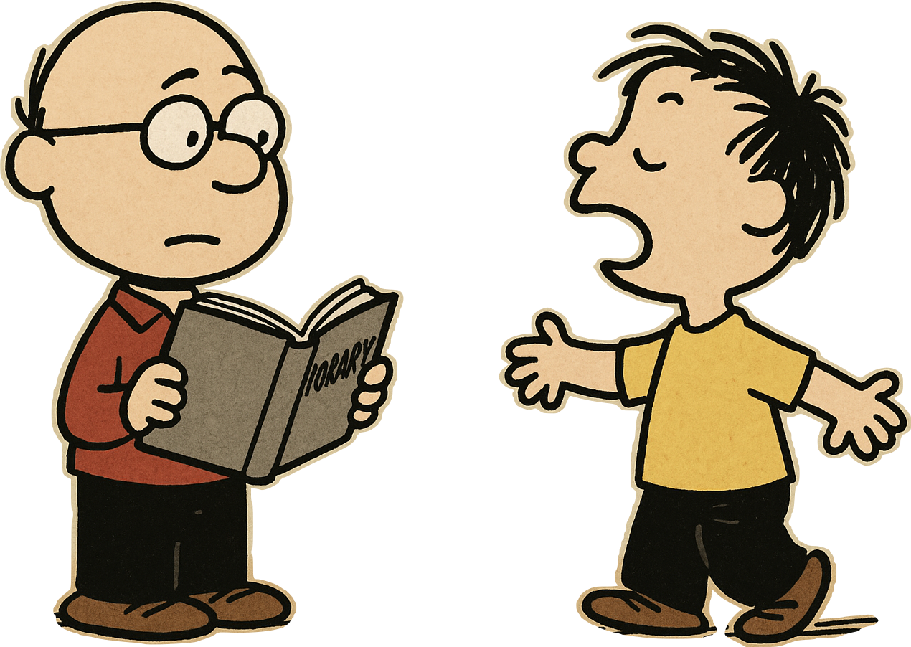
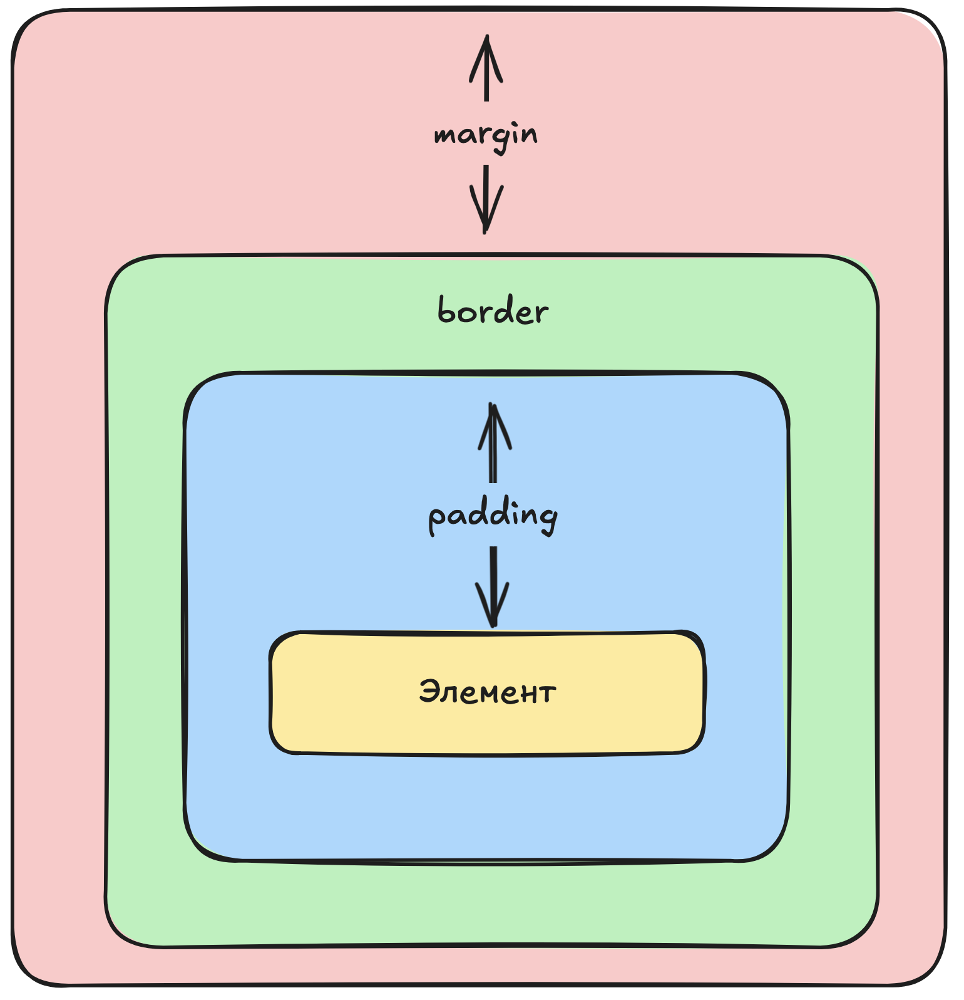

# Основы веб-разработки. Занятие 1

## Как появился Интернет и сайты

- **1990–1991** — Тим Бернерс-Ли придумал **HTML** и **HTTP**, чтобы учёные могли обмениваться документами.
- **1993** — HTML и Всемирная паутина (World Wide Web) стали общедоступными.
- **1995** — появился **JavaScript** (для «живых» страниц) и **PHP** (для работы с данными на сервере).
- **1996** — придумали **CSS**, чтобы сайты выглядели одинаково в разных браузерах: HTML отвечает за структуру, CSS — за внешний вид.
- **2012** — Microsoft сделала **TypeScript**, чтобы писать более строгий код на базе JavaScript.
- **2015** — началась разработка **WebAssembly**, чтобы запускать быстрые программы прямо в браузере.

👉 Сегодня все сайты используют эти технологии.

---

## Что такое язык программирования

Компьютер понимает только **нули и единицы** (бинарный код). Чтобы нам не мучиться, придумали языки программирования.

**Язык программирования** — это способ записать инструкции для компьютера понятным для человека способом.

- **Компилируемые языки**: сначала переводятся целиком в «нули и единицы», потом запускаются. Работают быстро.
- **Интерпретируемые языки**: переводятся прямо во время работы программы. Можно запускать сразу, но медленнее.

**Компилируемый язык** похож на человека, который выучил английский. Он потратил время на обучение (компиляцию), но теперь разговаривает быстро.
**Интерпретируемый язык** похож на человека со словарём. Учить язык он не стал, но разговаривать может сразу, правда — медленнее.



👉 Веб-языки (HTML, CSS, JS) — интерпретируемые: ошибки видно только при запуске.

---

## HTML — основа сайта

**HTML** — это обычный текстовый файл, только с особыми правилами. Он говорит браузеру: где заголовок, где картинка, где кнопка.

### Теги

Теги — это команды в угловых скобках `< >`.

- **Обычные (открывающий + закрывающий)**:

```html
<h1>Заголовок</h1>
```

- **Самозакрывающиеся**:

```html
<input placeholder="Поле ввода" />
```

Атрибуты (например, `placeholder`) уточняют, как работает тег.

### Часто используемые теги

- `<h1>`–`<h6>` — заголовки разных уровней.

```html
<h1>Главный заголовок</h1>
<h2>Подзаголовок</h2>
<h3>Маленький подзаголовок</h3>
```

- `<button>` — кнопка.

```html
<button>Нажми меня</button>
```

- `<a>` — ссылка (`href` указывает адрес).

```html
<a href="https://example.com">Перейти на сайт</a>
```

- `<div>` — блок-контейнер, помогает группировать элементы.

```html
<div>
	<h2>Новости</h2>
	<p>Сегодня вышла новая статья...</p>
</div>
```

👉 HTML — это «скелет» страницы.

---

## CSS — внешний вид сайта

**CSS** отвечает за то, как выглядит страница: цвета, размеры, шрифты, расположение.

### Подключение CSS

1. Внутри тега (редко):

```html
<h1 style="color: red;">Красный заголовок</h1>
```

2. Через `<style>`:

```html
<style>
	h1 {
		color: blue;
	}
</style>
```

3. В отдельном файле (лучший вариант):

```html
<link rel="stylesheet" href="style.css" />
```

### Пример стиля

```css
p {
	color: gray;
	font-size: 18px;
	text-align: center;
}
```

### Важные свойства CSS

- `color` — цвет текста
- `background-color` — цвет фона
- `font-size` — размер текста
- `font-family` — шрифт
- `text-align` — выравнивание (left, center, right)
- `margin` — внешние отступы
- `padding` — внутренние отступы
- `border` — рамка
- `border-radius` — скругление краев


👉 CSS — это «одежда» сайта.

---

## Практика

### 1. Создадим пустую страницу
Создайте файл `index.html` и напишите в нем:

**index.html**
```html
<!DOCTYPE html>
<html lang="en">
	<head>
		<meta charset="UTF-8" />
		<meta name="viewport" content="width=device-width, initial-scale=1.0" />
		<title>Document</title>
	</head>
	<body> </body>
</html>
```

Это шаблон, который нужно добавить, чтобы даже старые браузеры могли открывать наш сайт.

1. `<!DOCTYPE html>` говорит, что мы используем последнюю версию html
2. `<html lang="en">` это _html тег_ он говорит браузеру, что все после него до _закрывающего тега_ `</html>` будет html. `lang="en"` указывает на язык, это влияет только на то, как будет выдаваться наш сайт в поисковвиках
3. `<head>` и `</head>` это область в которой находится все, что не должен видеть пользователь, в нашем случае:
	1. `meta charset="UTF-8" />` говорит браузеру о том что символы на нашем сайте используют UTF-8 кодировку
	2. `<meta name="viewport" content="width=device-width, initial-scale=1.0" />` эта страшнющая строка говорит за ширину страницы брать ширину устройства, чтобы сайт лучше отображался на экранах с нестандартным разрешением и телефонах
	3. `<title>Document</title>` это то как браузер будет называть нашу страницу
4. `<body>` и `</body>` это та часть сайта, которая уже будет видна пользователю: кнопки, поля для ввода текста, картинки и так далее

### 2. Добавим содержания странице
Добавьте текст внутрь тега `body`
```html
<body>
		<h1>🦆 Утки</h1>
		
		<p>У́тка — представитель птиц из нескольких родов семейства утиных: пеганки, нырковые утки, савки, речные утки, утки-пароходы, мускусные утки и крохали; всего более 110 видов. Распространены утки широко, в России более 30 видов.</p>
	</body>
```

Мы добавили 3 тега на нашу страницу:
1. `h1` - заголовок нашей страницы
2. `img` - картинка
	1. `src` - это то, откуда будет взята картинка, в моем случае из другого сайта
	2. `alt` - это текст, который появится на странице, если картинка не появится, чтобы пользователь знал что на ней было
3. `p` - абзац текста

Сейчас, если открыть index.html в браузере, то сайт не очень. Картинка слишком большая и не помещается на экране. Мы можем ее стилизовать с помощью CSS:
1. Создайте файл `style.css` рядом с `index.html`.
2. Чтобы index.html знал о новом файле, в head нужно добавить строчку:
```html
<link rel="stylesheet" href="style.css">
```

Теперь наш html знает, что мы используем `style.css` как `stylesheet` (таблицу стилей) и будет ее обрабатывать
3. Напишите в style.css:
```css
body{
    background-color: azure;
    font-family:Arial, Helvetica, sans-serif
}

h1 {
    text-align: center;
}

img {
	width: 50%;
	border-radius: 999px;
	aspect-ratio: 1/1;
}

p{
    background-color: white;
    padding: 15px;
    border-radius: 15px;
    border: 1px solid black;
    text-align: justify;
}
```

Здесь мы говорим браузеру как он должен отображать наши элементы. Вы можете открыть index.html в браузере и посмотреть как он изменился. 

>Попробуйте переделать этот сайт под себя и ваши интересы

---

# Для любознательных

## Виды графики

### Векторная

- Состоит из формул (линий, окружностей).
- Можно увеличивать без потери качества.
- Форматы: **SVG, AI**.
- Подходит для логотипов, иконок, схем.

### Растровая

- Состоит из пикселей (точек).
- При увеличении качество теряется.
- Форматы: **JPG, PNG, GIF**.
- Подходит для фото и картинок с множеством деталей.

---

## Фронтенд и бэкенд

- **Фронтенд** — то, что видит пользователь в браузере.  
   HTML (структура), CSS (красота), JS (динамика).  
   Примеры: кнопки, формы, корзина.
- **Бэкенд** — то, что работает на сервере «за кулисами».  
   Python, PHP, Java, базы данных.  
   Примеры: регистрация, хранение заказов, поиск товаров.

👉 Фронтенд — «лицо» сайта, бэкенд — «мозг».

## Базы данных

**База данных** — это организованное хранилище информации.

Примеры из жизни:

- Дневник с оценками — база данных.
- Список товаров в магазине — база данных.

Сейчас самые распростроненные базы данных - реляционные, в них данные хранятся в виде таблицы:

| Номер | Имя      | Дата рождения |
| ----- | -------- | ------------- |
| 1     | Ксюша    | 1 сентября    |
| 2     | Слава    | 2 декабря     |
| 3     | Святозар | 14 апреля     |

👉 Базы данных — это «память» сайтов и приложений.

---

📌 **Итого**

- HTML — скелет, CSS — внешний вид, JS — интерактивность.
- Фронтенд — то, что видит пользователь.
- Бэкенд — то, что обрабатывает данные на сервере.
- Базы данных — хранят информацию.
