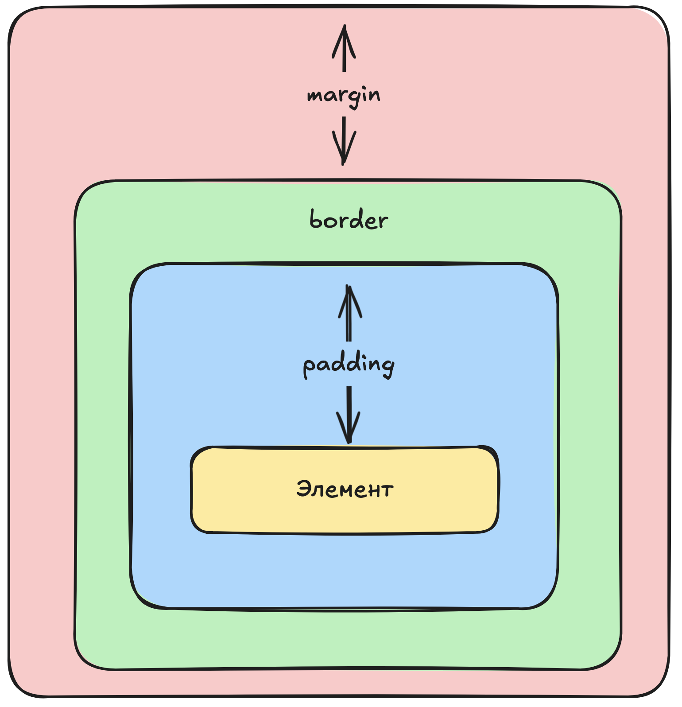

# Основы веб-разработки. Занятие 1

## Как появился Интернет и сайты

- **1990–1991** — Тим Бернерс-Ли придумал **HTML** и **HTTP**, чтобы учёные могли обмениваться документами.
- **1993** — HTML и Всемирная паутина (World Wide Web) стали общедоступными.
- **1995** — появился **JavaScript** (для «живых» страниц) и **PHP** (для работы с данными на сервере).
- **1996** — придумали **CSS**, чтобы сайты выглядели одинаково в разных браузерах: HTML отвечает за структуру, CSS — за внешний вид.
- **2012** — Microsoft сделала **TypeScript**, чтобы писать более строгий код на базе JavaScript.
- **2015** — началась разработка **WebAssembly**, чтобы запускать быстрые программы прямо в браузере.

👉 Сегодня все сайты используют эти технологии.

---

## Что такое язык программирования

Компьютер понимает только **нули и единицы** (бинарный код). Чтобы нам не мучиться, придумали языки программирования.

**Язык программирования** — это способ записать инструкции для компьютера понятным для человека способом.

- **Компилируемые языки**: сначала переводятся целиком в «нули и единицы», потом запускаются. Работают быстро.
- **Интерпретируемые языки**: переводятся прямо во время работы программы. Можно запускать сразу, но медленнее.

**Компилируемый язык** похож на человека, который выучил английский. Он потратил время на обучение (компиляцию), но теперь разговаривает быстро.
**Интерпретируемый язык** похож на человека со словарём. Учить язык он не стал, но разговаривать может сразу, правда — медленнее.


👉 Веб-языки (HTML, CSS, JS) — интерпретируемые: ошибки видно только при запуске.

---

## HTML — основа сайта

**HTML** — это обычный текстовый файл, только с особыми правилами. Он говорит браузеру: где заголовок, где картинка, где кнопка.

### Теги

Теги — это команды в угловых скобках `< >`.

- **Обычные (открывающий + закрывающий)**:

```html
<h1>Заголовок</h1>
```

- **Самозакрывающиеся**:

```html
<input placeholder="Поле ввода" />
```

Атрибуты (например, `placeholder`) уточняют, как работает тег.

### Часто используемые теги

- `<h1>`–`<h6>` — заголовки разных уровней.

```html
<h1>Главный заголовок</h1>
<h2>Подзаголовок</h2>
<h3>Маленький подзаголовок</h3>
```

- `<button>` — кнопка.

```html
<button>Нажми меня</button>
```

- `<a>` — ссылка (`href` указывает адрес).

```html
<a href="https://example.com">Перейти на сайт</a>
```

- `<div>` — блок-контейнер, помогает группировать элементы.

```html
<div>
	<h2>Новости</h2>
	<p>Сегодня вышла новая статья...</p>
</div>
```

👉 HTML — это «скелет» страницы.

---

## CSS — внешний вид сайта

**CSS** отвечает за то, как выглядит страница: цвета, размеры, шрифты, расположение.

### Подключение CSS

1. Внутри тега (редко):

```html
<h1 style="color: red;">Красный заголовок</h1>
```

2. Через `<style>`:

```html
<style>
	h1 {
		color: blue;
	}
</style>
```

3. В отдельном файле (лучший вариант):

```html
<link rel="stylesheet" href="style.css" />
```

### Пример стиля

```css
p {
	color: gray;
	font-size: 18px;
	text-align: center;
}
```

### Важные свойства CSS

- `color` — цвет текста
- `background-color` — цвет фона
- `font-size` — размер текста
- `font-family` — шрифт
- `text-align` — выравнивание (left, center, right)
- `margin` — внешние отступы
- `padding` — внутренние отступы
- `border` — рамка


👉 CSS — это «одежда» сайта.

---

## Виды графики

### Векторная

- Состоит из формул (линий, окружностей).
- Можно увеличивать без потери качества.
- Форматы: **SVG, AI**.
- Подходит для логотипов, иконок, схем.

### Растровая

- Состоит из пикселей (точек).
- При увеличении качество теряется.
- Форматы: **JPG, PNG, GIF**.
- Подходит для фото и картинок с множеством деталей.

---

## Фронтенд и бэкенд

- **Фронтенд** — то, что видит пользователь в браузере.  
   HTML (структура), CSS (красота), JS (динамика).  
   Примеры: кнопки, формы, корзина.
- **Бэкенд** — то, что работает на сервере «за кулисами».  
   Python, PHP, Java, базы данных.  
   Примеры: регистрация, хранение заказов, поиск товаров.

👉 Фронтенд — «лицо» сайта, бэкенд — «мозг».

---

## Базы данных

**База данных** — это организованное хранилище информации.

Примеры из жизни:

- Дневник с оценками — база данных.
- Список товаров в магазине — база данных.

### Виды баз

- **Реляционные (SQL, таблицы)** — MySQL, PostgreSQL.
- **Документные (JSON)** — MongoDB.
- **Ключ-значение** — Redis.
- **Графовые** — Neo4j (связи, например в соцсетях).

### Основные действия (CRUD)

- **C**reate — добавить
- **R**ead — прочитать
- **U**pdate — изменить
- **D**elete — удалить

👉 Базы данных — это «память» сайтов и приложений.

---

📌 **Итого**

- HTML — скелет, CSS — внешний вид, JS — интерактивность.
- Фронтенд — то, что видит пользователь.
- Бэкенд — то, что обрабатывает данные на сервере.
- Базы данных — хранят информацию.
