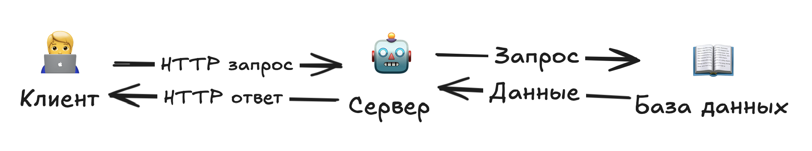
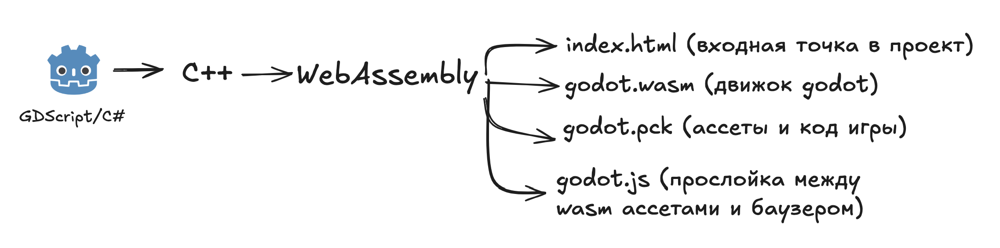

# CSS `display`

**`display`** определяет, как элемент будет вести себя и каким образом он будет отображаться.

**Это влияет на:**

- занимает ли элемент всю строку или только нужное место,
- можно ли располагать другие элементы рядом,
- поддерживает ли вложенные блоки.

## ⏳ Хронология событий

### 1996

В первых версиях CSS уже существовали `display` `block` / `inline`

### 2002

Появился `display: inline-block`. Он комбинирует оба свойства из предыдущих версий, но он еще будет изменяться до 2011

### 2013-2014

Появился `display: flex`. Он разрабатывался еще с 2009, но и до широкой поддержки браузерами прийдется ждать до 2017

### 2017

Появился `display: grid`. Томился с 2011. Сейчас это основной инствумент для создания сеток

---

## Основные значения

### block

- Элемент занимает **всю ширину строки**.
- Начинается с новой строки.
- Можно задавать ширину, высоту, отступы.
- Примеры: `<div>`, `<p>`, `<h1>…<h6>`.

```html
<div>Элемент</div>
<style>
	div {
		background: pink;
	}
</style>
```

Попробуйте запустить этот код. Вы увидете, что `div` занимает всю строку

---

### inline

- Элемент занимает только **ширину своего содержимого**.
- Мы не можем использовать width и height чтобы не портить разметку текста
- Примеры: `<span>`, `<a>`, `<strong>`.

```css
<p>
<span class="blue">Lorem</span>, ipsum dolor sit amet consectetur adipisicing elit.
</p>

<style>
	.blue {
		background: #93bced;
		color: #30619c;
		font-weight: bold;
		padding: 0 8px;
		border-radius: 999px;
	}
</style>
```

Видите? `span` не выходит на новую строчку, а встраивается в текст.

---

### inline-block

- Как `inline`, но можно задавать размеры (`width`/`height`).
- Элементы располагаются в одну строку.

```css
<div class="menu">
	<a href="#" class="menu-item">Главная</a>
	<a href="#" class="menu-item">О нас</a>
	<a href="#" class="menu-item">Услуги</a>
	<a href="#" class="menu-item">Контакты</a>
</div>
<style>
	.menu {
		background: #f0f0f0;
		padding: 10px;
	}

	.menu-item {
		display: inline-block; /* ключевое свойство */
		padding: 10px 20px;
		margin: 5px;
		background: #4caf50;
		color: white;
		border-radius: 5px;
		text-decoration: none;
		font-family: Arial, sans-serif;
	}

	.menu-item:hover {
		background: #45a049;
	}
</style>

Мы можем расположить элементы в ряд и задать их высоту и ширину 🤯

```

---

### none

- Элемент **полностью исчезает** из страницы.
- Не занимает места.

```css
button {
	display: none;
}
```

Даже смешного примера не будет. Элемент с таким свойством просто не отображается

---

## 3. Современные значения

### flex

- Включает **flex-контейнер**.
- Дети распределяются по гибким правилам.
- Используется для адаптивной верстки.

---

#### flex-direction

Определяет направление элементов:

- `row` (по умолчанию)
- `row-reverse`
- `column`
- `column-reverse`

```html
<h1>Обычные кнопки</h1>
<div>
	<button>1</button>
	<button>2</button>
	<button>3</button>
</div>

<h1>column</h1>
<div class="flex column">
	<button>1</button>
	<button>2</button>
	<button>3</button>
</div>

<h1>row</h1>
<div class="flex row">
	<button>1</button>
	<button>2</button>
	<button>3</button>
</div>

<h1>column reverse</h1>
<div class="flex column-reverse">
	<button>1</button>
	<button>2</button>
	<button>3</button>
</div>

<h1>row reverse</h1>
<div class="flex row-reverse">
	<button>1</button>
	<button>2</button>
	<button>3</button>
</div>

<style>
	.flex {
		display: flex;
	}
	.column {
		flex-direction: column;
	}
	.column-reverse {
		flex-direction: column-reverse;
	}
	.row {
		flex-direction: row;
	}
	.row-reverse {
		flex-direction: row-reverse;
	}
</style>
```

---

#### justify-content

Выравнивание элементов **по горизонтали**:

- `start`
- `end`
- `center`
- `space-between`
- `space-around`
- `space-evenly`

```html
<div class="flex row justify-space-between">
	<button>1</button>
	<button>2</button>
	<button>3</button>
</div>

<div class="flex row justify-start">
	<button>1</button>
	<button>2</button>
	<button>3</button>
</div>

<div class="flex row justify-end">
	<button>1</button>
	<button>2</button>
	<button>3</button>
</div>

<style>
	.flex {
		display: flex;
	}
	.row {
		flex-direction: row;
	}
	.justify-space-between {
		justify-content: space-between;
	}
	.justify-start {
		justify-content: start;
	}
	.justify-end {
		justify-content: end;
	}
</style>
```

---

#### align-items

Выравнивание элементов **по вертикали** (для одной строки):

- `flex-start`
- `center`
- `flex-end`
- `stretch`
- `baseline`

```html
<div class="flex row align-start">
	<button>1</button>
	<button>2</button>
	<button>3</button>
</div>

<div class="flex row align-center">
	<button>1</button>
	<button>2</button>
	<button>3</button>
</div>

<div class="flex row align-end">
	<button>1</button>
	<button>2</button>
	<button>3</button>
</div>

<style>
	.flex {
		display: flex;
	}
	.row {
		flex-direction: row;
	}
	.align-start {
		align-items: flex-start;
		height: 100px;
		background: #f0f0f0;
	}
	.align-center {
		align-items: center;
		height: 100px;
		background: #f0f0f0;
	}
	.align-end {
		align-items: flex-end;
		height: 100px;
		background: #f0f0f0;
	}
</style>
```

---

#### align-content

Выравнивание **нескольких строк** (работает с `flex-wrap`):

```html
<div class="flex row wrap align-content-space-between">
	<button>1</button><button>2</button><button>3</button> <button>4</button
	><button>5</button><button>6</button>
</div>

<style>
	.flex {
		display: flex;
	}
	.row {
		flex-direction: row;
	}
	.wrap {
		flex-wrap: wrap;
		height: 150px;
		background: #f0f0f0;
	}
	.align-content-space-between {
		align-content: space-between;
	}
</style>
```

---

#### flex-wrap

Позволяет элементам переноситься на новую строку:

```html
<div class="flex row wrap">
	<button>1</button>
	<button>2</button>
	<button>3</button>
	<button>4</button>
	<button>5</button>
	<button>6</button>
</div>

<style>
	.flex {
		display: flex;
	}
	.row {
		flex-direction: row;
	}
	.wrap {
		flex-wrap: wrap;
		width: 200px;
		background: #f0f0f0;
	}
</style>
```

---

#### gap

Расстояние между элементами:

```html
<div class="flex row gap">
	<button>1</button>
	<button>2</button>
	<button>3</button>
</div>

<style>
	.flex {
		display: flex;
	}
	.row {
		flex-direction: row;
	}
	.gap {
		gap: 20px;
	}
</style>
```

---

#### order

Меняет порядок элементов:

```html
<div class="flex row">
	<button style="order: 2;">1</button>
	<button style="order: 1;">2</button>
	<button style="order: 3;">3</button>
</div>

<style>
	.flex {
		display: flex;
	}
	.row {
		flex-direction: row;
	}
</style>
```

---

Flexbox позволяет:

- Направлять элементы (`flex-direction`)
- Управлять выравниванием (`justify-content`, `align-items`, `align-content`)
- Переносить элементы (`flex-wrap`)
- Задавать расстояние (`gap`)
- Менять порядок (`order`)

---

Отличная идея 👍 Давай сделаем такой же конспект по **CSS Grid** в формате Markdown, как мы делали по Flexbox.

---

### grid

- Включает **grid-контейнер**.
- Дети располагаются по строкам и колонкам.
- Позволяет создавать сложные сетки.

---

#### grid-template-columns / grid-template-rows

Определяет количество и ширину колонок/строк.

```html
<div class="grid columns-3 rows-2">
	<div>1</div>
	<div>2</div>
	<div>3</div>
	<div>4</div>
	<div>5</div>
	<div>6</div>
</div>

<style>
	.grid {
		display: grid;
		gap: 10px;
		background: #f0f0f0;
	}
	.columns-3 {
		grid-template-columns: 100px 100px 100px;
	}
	.rows-2 {
		grid-template-rows: 50px 50px;
	}
	.grid div {
		background: #4caf50;
		color: white;
		display: flex;
		justify-content: center;
		align-items: center;
	}
</style>
```

---

#### repeat()

Удобная функция для повторения колонок или строк.

```html
<div class="grid repeat-columns">
	<div>1</div><div>2</div><div>3</div> <div>4</div><div>5</div><div>6</div>
</div>

<style>
	.grid {
		display: grid;
		gap: 10px;
		background: #f0f0f0;
	}
	.repeat-columns {
		grid-template-columns: repeat(3, 100px);
		grid-template-rows: repeat(2, 50px);
	}
	.grid div {
		background: #4caf50;
		color: white;
		display: flex;
		justify-content: center;
		align-items: center;
	}
</style>
```

---

#### fr (fractional unit)

Позволяет делить пространство на доли.

```html
<div class="grid fr-columns"> <div>1</div><div>2</div><div>3</div> </div>

<style>
	.grid {
		display: grid;
		gap: 10px;
		background: #f0f0f0;
	}
	.fr-columns {
		grid-template-columns: 1fr 2fr 1fr;
	}
	.grid div {
		background: #4caf50;
		color: white;
		display: flex;
		justify-content: center;
		align-items: center;
	}
</style>
```

---

#### grid-gap (gap)

Задает расстояние между строками и колонками.

```html
<div class="grid gap-example">
	<div>1</div><div>2</div><div>3</div> <div>4</div><div>5</div><div>6</div>
</div>

<style>
	.grid {
		display: grid;
		background: #f0f0f0;
	}
	.gap-example {
		grid-template-columns: repeat(3, 100px);
		grid-gap: 20px;
	}
	.grid div {
		background: #4caf50;
		color: white;
		display: flex;
		justify-content: center;
		align-items: center;
	}
</style>
```

---

#### grid-column / grid-row

Позволяет элементу занимать несколько ячеек.

```html
<div class="grid column-span">
	<div class="wide">1</div>
	<div>2</div>
	<div>3</div>
	<div>4</div>
</div>

<style>
	.grid {
		display: grid;
		gap: 10px;
		background: #f0f0f0;
	}
	.column-span {
		grid-template-columns: repeat(3, 100px);
	}
	.wide {
		grid-column: span 2; /* растянуть на 2 колонки */
	}
	.grid div {
		background: #4caf50;
		color: white;
		display: flex;
		justify-content: center;
		align-items: center;
	}
</style>
```

---

#### justify-items / align-items

Выравнивание содержимого внутри ячеек.

```html
<div class="grid align-example"> <div>1</div><div>2</div><div>3</div> </div>

<style>
	.grid {
		display: grid;
		grid-template-columns: repeat(3, 100px);
		grid-template-rows: 100px;
		background: #f0f0f0;
	}
	.align-example {
		justify-items: center; /* по горизонтали */
		align-items: center; /* по вертикали */
	}
	.grid div {
		background: #4caf50;
		color: white;
		width: 50px;
		height: 50px;
		display: flex;
		justify-content: center;
		align-items: center;
	}
</style>
```

---

#### justify-content / align-content

Выравнивание всей сетки внутри контейнера.

```html
<div class="grid content-example"> <div>1</div><div>2</div><div>3</div> </div>

<style>
	.grid {
		display: grid;
		grid-template-columns: repeat(3, 50px);
		grid-template-rows: 50px;
		height: 150px;
		background: #f0f0f0;
	}
	.content-example {
		justify-content: center; /* сетка по горизонтали */
		align-content: center; /* сетка по вертикали */
	}
	.grid div {
		background: #4caf50;
		color: white;
		display: flex;
		justify-content: center;
		align-items: center;
	}
</style>
```

---

#### grid-area

Позволяет элементу занимать сразу несколько строк и колонок.

```html
<div class="grid area-example">
	<div class="header">Header</div>
	<div class="sidebar">Sidebar</div>
	<div class="main">Main</div>
	<div class="footer">Footer</div>
</div>

<style>
	.grid {
		display: grid;
		grid-template-columns: 100px 1fr;
		grid-template-rows: 50px 100px 50px;
		gap: 5px;
		background: #f0f0f0;
	}
	.header {
		grid-column: 1 / 3;
	}
	.sidebar {
		grid-row: 2 / 3;
	}
	.main {
		grid-column: 2 / 3;
		grid-row: 2 / 3;
	}
	.footer {
		grid-column: 1 / 3;
	}
	.grid div {
		background: #4caf50;
		color: white;
		display: flex;
		justify-content: center;
		align-items: center;
	}
</style>
```

---

## 📌 Итог

Grid позволяет:

- Создавать строки и колонки (`grid-template-columns`, `grid-template-rows`)
- Использовать гибкие единицы (`fr`, `repeat()`)
- Управлять расстоянием (`gap`)
- Растягивать элементы (`grid-column`, `grid-row`)
- Выравнивать содержимое (`justify-items`, `align-items`)
- Управлять сеткой целиком (`justify-content`, `align-content`)
- Создавать сложные макеты (`grid-area`)

---

Хочешь, я соберу **таблицу-сравнение Flex vs Grid** (когда лучше применять одно, а когда другое)?

---

## Итоги

- `block` — занимает всю строку.
- `inline` — только содержимое, без размеров.
- `inline-block` — inline + можно размеры.
- `none` — скрывает.
- `flex`, `grid` — современные способы верстки.

---

## Задания

1. Inline-block
   Создай три кнопки (`<button>`) и выстрой их в ряд с помощью inline-block.
   Добавь им разные размеры и убедись, что они не ломают строку.
   Попробуй сделать меню сайта (ссылки `<a>` рядом друг с другом).
2. Flex — направления
   Размести 4 блока (например, квадраты 100×100).
   Выстрой их:
   В строку (row).
   В колонку (column).
   В обратных направлениях (row-reverse, column-reverse).
   Попробуй центрировать блоки с помощью justify-content и align-items.
3. Flex — карточки
   Сделай 6 карточек одинакового размера.
   Используя flex-wrap, настрой так, чтобы они переносились на новую строку.
   Добавь gap, чтобы был отступ между ними.
4. Grid — сетка
   Создай сетку 3×3 (9 блоков).
   Выстрой их с одинаковыми размерами с помощью grid-template-columns и grid-template-rows.
   Попробуй объединить одну из ячеек так, чтобы она занимала два столбца (grid-column: span 2).

# ⭐️ Бонус-тема: Браузернные игры

## 1. Начало: текст и простейший HTML (1990-е)

- Первые браузеры поддерживали только **HTML и изображения**.
- Игры были **текстовыми**: викторины, простые RPG в стиле «choose your own adventure».
- Всё строилось на HTML-страницах и ссылках → переход по ссылке = выбор действия.

---

## 2. Java-апплеты и Flash (середина 1990-х – 2000-е)

### Java-апплеты

- В браузерах появилась поддержка **Java-апплетов**.
- Можно было рисовать графику и реагировать на действия мышки/клавиатуры.
- Минусы: требовалась установка Java, низкая производительность.

### Flash

- Середина 1990-х Flash стал главной платформой для игр.
- Поддерживал **векторную графику, анимацию, звук**.
- Примеры: **Line Rider, Fancy Pants Adventure, Bloons Tower Defense**.

> Сейчас Flash уже не поддерживается 💀, так как в нем нашли критические уязвимости в безопасности. К тому моменту (2017) большую часть проектов разработки перенесут на HTML5 + CSS + JS или WebAssembly

---

## 3. Серверные игры (конец 1990-х – 2000-е)



- Игры на **PHP, Perl, ASP**.
- Жанр: **браузерные стратегии и менеджеры**.
- Игрок делал ход, сервер сохранял его в базу даных, страница перезагружалась.
- Примеры:
  - **OGame** (космическая стратегия, 2002).
  - **Travian** (экономическая стратегия, 2004).

---

## 4. Эпоха HTML5 и JavaScript (2010-е)

- Flash теряет популярность (из-за проблем с безопасностью и мобильными устройствами).
- Появление **HTML5 Canvas** и **WebGL**.
- JavaScript стал главным языком для браузерных игр.
- Появились мощные движки:
  - **Phaser.js** (2D-игры).
  - **Three.js** (3D на WebGL).
- Игры стали работать без плагинов, прямо в браузере.

---

## 5. WebAssembly и современные игры (2020-е)

- Появился **WebAssembly (WASM)** → можно запускать код **C++/Rust** в браузере.
- Крупные игровые движки (Unity, Unreal Engine) научились экспортировать проекты под WebGL/WebAssembly.
- В браузере теперь можно запустить:
  - 3D-шутеры, RPG, стратегии.
  - Онлайн-мультиплеер через **WebSockets** и **WebRTC**.
- Примеры:
  - **Krunker.io** (онлайн-шутер).
  - Порт **Doom 3** и других ПК-игр прямо в браузере.

Пусть и можно запустить игры с больших движнов в браузере, но:

- _Ограничения на железо_.Браузер не выделит много мощности компьютера на 1 страницу
- _Совместимость_. Браузеры могут обрабатывать WebGL по разному

### Пример

Большие движки компилируются чуть по своему, но смысл одинаковый



1. Код игры преобразуется в С++, а тот в WebAssembly
2. Все ассеты (картинки, музыка) помещаются в отдельный файл
3. Генерируются файлы:

- `index.html`. Браузер открывает эту страницу. На ней находится `<canvas>` для отображения графики
- `godot.wasm` - код движка
- `godot.pck` - ассеты (картинки, музыка)
- `godot.js` - оркестрирует браузер `wasm` и `pck` для работы вместе

---

Это все темы для отдельных курсов. **Технологии не то, чтобы сложные**, но это не тот подход к программированию, который тренируется для написания сайтов

Чтобы писать простые игры достаточно и простых HTML, CSS и JavaScript. Для чуть более продвинутых проектов можно использовать библиотеки для JavaScript:

- **Phaser 3**: Самый популярный и рекомендованный выбор для 2D-игр
- **PixiJS**: Супербыстрый 2D-рендерер. Не имеет встроенной физики или системы анимации, как Phaser, но идеален, если вам нужна максимальная производительность для графических приложений и вы готовы собрать остальное сами.
- **Three.js / Babylon.js**: Лидеры для создания 3D-игр в браузере
  - Three.js более популярен и проще для старта
  - Babylon.js имеет некоторые продвинутые фичи "из коробки" (например, встроенную поддержку VR).
- **MelonJS**: Еще один хороший 2D-фреймворк, немного проще, чем Phaser.

---

## 📌 Итог

- **1990-е** → текстовые и простейшие HTML-игры.
- **2000-е** → золотая эпоха Flash и серверных стратегий.
- **2010-е** → HTML5 + JavaScript, отказ от плагинов.
- **2020-е** → WebAssembly, большие 3D-игры и мультиплеер в браузере.
