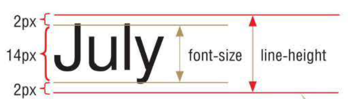

# Область применения стилей

Стиль может меняться - например при наведении курсора на ссылку

## Изменение стиля при наведении указателя мыши

Если задать для `a` специальный класс `hover`, вы сможете менять стиль  кнопки при наведении курсора. Так как этот стиль применяется только при определенных условиях, такие классы называются _псевдоклассами_

```css
button:hover {
	color: red;
	font-weight: bold;
}
```

## Изменение при щелчке

Состояние элемента пока на него нажата мышь называется _активным_

```css
button:active {
	color: red;
	font-weight: bold;
}
```

## Изменение при фокусе

Если пользователь кликнул на поле ввода (`input`), то оно находится в _фокусе_

```css
input:focus {
	border: 4px solid red;
}
```

> Псевдоклассов сильно больше, но это самые частовстречающиеся.

# Свойства текста

## Параметры расположения текста

### Высота строки:

```css
h1 {
	font-size: 14px; /* Размер шрифта */
	line-height: 18px; /* Высота строки */
}
```



Если не указать единицы измерения для высоты строки, то высота будет равна размеру шрифта умноженному на это значение:

```css
h1 {
	line-height: 1.2; /* Высота строки будет в 1.2 раза больше размера шрифта */
}
```

### Положение текста

`text-align` и `vertical-align` позволяют задавать положение текста

**Значения text-align:**

| Значение | Описание               |
| -------- | ---------------------- |
| left     | выравнивание влево     |
| right    | выравнивание вправо    |
| center   | выравнивание по центру |
| justify  | выравнивание по ширине |

**Значения vertical-align**

| Значение | Описание                                             |
| -------- | ---------------------------------------------------- |
| baseline | Выравнивание по умолчанию                            |
| sub      | Выравнивание под строкой                             |
| super    | Выравнивание над строкой                             |
| top      | Выравнивание по верхнему краю родительского элемента |
| bottom   | Выравнивание по нижнему краю родительского элемента  |

## Отступ с красной строки

```css
p {
	text-indent: 3em;
}
```

> Этих свойств сильно больше, но этих нам хватит за глаза

## Свойства шрифта

### Цвет текста

```css
body {
	color: blue;
}
```

### Курсив

```css
span {
	font-style: italic;
}
```

### Жирный шрифт

```css
span {
	font-weight: bold;
}
```

### Шрифт

```css
body {
	font-family: Arial;
}
```

> Можно прописать несколько значений через запятую, и тогда, если у пользователя не сработает 1 шрифт, то будет использоваться следующий

---

# Адаптивный веб-дизайн

## ⌛️ История

1. **2000-е годы**  
   Веб делали "фиксированным": сайты имели строгую ширину (например, 960px), и выглядели одинаково только на компьютере. На телефонах и маленьких экранах такие сайты ломались — текст становился мелким, приходилось прокручивать страницу вбок.
2. **Появление смартфонов (2007–2010)**  
   После выхода iPhone и Android-смартфонов сайты стали открываться на устройствах с маленькими экранами. Стало очевидно, что нужна новая методика верстки.
3. **2010** — термин *Responsive Web Design* (RWD) ввёл **Итан Маркотт (Ethan Marcotte)**. Он описал три основных принципа:

   - **fluid grids** (гибкие сетки),
   - **flexible images** (гибкие изображения),
   - **media queries** (медиа-запросы).

4. **Сегодня**  
   Адаптивность — это стандарт. Современные фреймворки (Bootstrap, Tailwind, Foundation) сразу включают инструменты для адаптивного дизайна.

---
# Для любознательных:
## Принципы адаптивного дизайна

### **Гибкая сетка (flexible layout)**

Вместо фиксированных пикселей используют относительные единицы:

- `%`

```css
.container {
	width: 90%; /* занимает 90% экрана */
}
```

- **em** → зависит от размера шрифта **родительского элемента**.

```css
body {
	font-size: 16px;
}

p {
	font-size: 1.5em; /* 24px (1.5 * 16px) */
}
```

- **rem** → зависит от размера шрифта **корневого элемента** (`html`).

```css
html {
	font-size: 16px;
}

p {
	font-size: 1.5rem; /* всегда 24px, независимо от родителей */
}
```

- `vw` (viewport width),
- `vh` (viewport height).

### Гибкие изображения (fluid images)

Чтобы картинки не "вылазили" за пределы экрана:

```css
img {
	max-width: 100%;
	height: auto;
}
```

### медиа-запросы

> **Медиа-запросы**  позволяют применять разные стили **в зависимости от устройства и условий**: ширина экрана, ориентация, плотность пикселей и т. д.

Они появились в **CSS3 (2012 год)** и стали основой **адаптивной верстки**.

```css
@media (max-width: 768px) {
	body {
		background: lightblue;
	}
}
```

👉 Здесь фон будет голубым только на экранах до 768px (например, телефоны и маленькие планшеты).

**Общий синтаксис:**

```css
@media (тип устройства) and (условие) {
	/* стили */
}
```

- `тип устройства` — обычно `screen` (экран), но есть и `print` (печать), `speech` (чтение экраном).
- `условие` — правило (например, ширина экрана ≤ 768px).

> Тема очень объемная, но на практике эти примеры покрывают большую часть всех наших потребностей

1. **Размер экрана (ширина и высота)**

   - `max-width` — до определённой ширины
   - `min-width` — от определённой ширины

```css
@media (max-width: 600px) {
	...;
} /* ширина до 600px */
@media (min-width: 1024px) {
	...;
} /* ширина от 1024px */
```

2. **Ориентация экрана**

   - `orientation: portrait` (вертикально)
   - `orientation: landscape` (горизонтально)

```css
@media (orientation: landscape) {
	body {
		font-size: 18px;
	}
}
```

---

3. **Mobile First**  
   Сайты сначала проектируют для маленького экрана (телефон), а затем расширяют под планшеты и компьютеры.

```css
/* базовый стиль для телефона */
.menu {
	display: block;
}

/* для планшета */
@media (min-width: 768px) {
	.menu {
		display: flex;
	}
}
```

## display

```css
.grid {
	display: grid;
	grid-template-columns: repeat(auto-fit, minmax(250px, 1fr));
	gap: 1rem;
}
```

Создается сетка из произвольного количества колонок (`auto-fit`), каждая от 250px до 1 / количество колонок (`minmax(250px, 1fr)`)

```css
.flex {
	display: flex;
	flex-wrap: wrap;
}
```

Элементы будут переноситься на следующую строку если не помещаются

---

## 📌 Итог

Адаптивный HTML и CSS — это подход к верстке, при котором сайт **подстраивается под разные устройства**: телефоны, планшеты, ноутбуки и большие мониторы.  
Он основан на трёх вещах: **гибкая сетка + гибкие медиа + медиа-запросы**.
